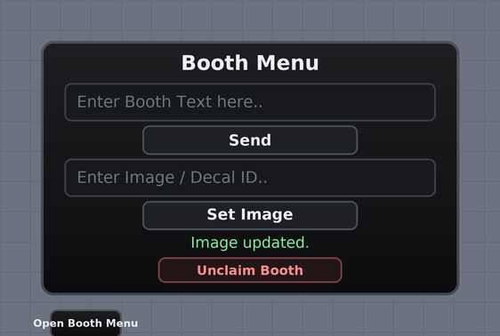

# Rate-my-avatar-korones

Booth system with player-set booth images and a dark-themed GUI.

Original booth system by **ywinfe** and **thugshaker**.

## Files

| Path | Goes in |
|---|---|
| `src/ServerScriptService/BoothServer.server.lua` | `ServerScriptService` (a `Script`) |
| `src/StarterGui/MainUI/Client.client.lua` | `StarterGui.MainUI.Client` (a `LocalScript`) |
| `Custom Booth (Modified).rbxm` | Both scripts already patched in — drag into Studio |
| `Custom Booth.rbxm` | The untouched original model |

## Setup

1. Insert `Custom Booth (Modified).rbxm` into Studio, then move its folders to the
   matching services (`ReplicatedStorage.RemoteEvent`, `StarterGui.MainUI`,
   `ServerScriptService.Server`, `Workspace.Booths`). Delete the `DELETE ME` part.
2. Play. Walk up to a booth and hold the prompt to claim it.

No HttpService, no external API — nothing extra to enable.

## The GUI

The image controls and the dark theme are applied **at run time** by the client
script, so nothing has to be recoloured or added by hand in Studio. New widgets
are cloned from the existing ones, so corners, strokes and fonts stay consistent.

| Row | Type | Purpose |
|---|---|---|
| `TextLabel` | TextLabel | "Booth Menu" title |
| `TextBox` | TextBox | booth text entry |
| `ChangeText` | TextButton | "Send" |
| `ImageBox` | TextBox | "Enter Image / Decal ID.." *(added)* |
| `ChangeImage` | TextButton | "Set Image" *(added)* |
| `Status` | TextLabel | green/red feedback line *(added)* |
| `UnclaimBooth` | TextButton | red-tinted "Unclaim Booth" |

Enter submits in both text boxes. Row heights, list padding and `UIPadding`
total **0.971** of the frame, so nothing is cut off by `ClipsDescendants`.

### Palette

| Role | RGB |
|---|---|
| Panel background | `12, 12, 14` |
| Panel outline | `64, 69, 78` |
| Input background | `24, 25, 29` |
| Button background | `30, 32, 37` |
| Unclaim (danger) | `34, 22, 24` bg / `255, 138, 138` text |
| Text / muted | `236, 238, 242` / `150, 156, 166` |

Edit the `THEME` table at the top of the client script to recolour everything.

## Server behaviour

- `ChangeImage` accepts a bare numeric ID, `rbxassetid://123`, or a link with
  `?id=123` — always rebuilt as `rbxassetid://<digits>`, so a player can never
  inject an arbitrary URL.
- Ownership is validated on every remote call, one booth per player, with a
  1-second per-player cooldown.
- Booth text is run through `FilterStringAsync`; set `FILTER_TEXT = false` if
  that API is unavailable on your platform.
- A booth unclaimed while a filter call was still yielding is never overwritten
  by the late result, and a booth whose owner left is always released.
- Booths added to the folder at run time are wired up automatically.

Compatible with Roblox/Luau from 2021 and earlier — no `task.*`, attributes, or
string interpolation.
