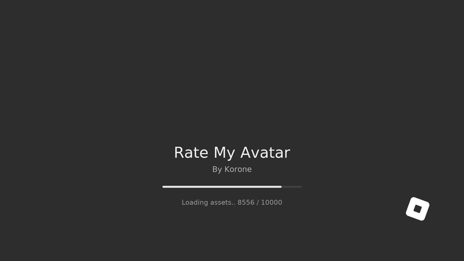
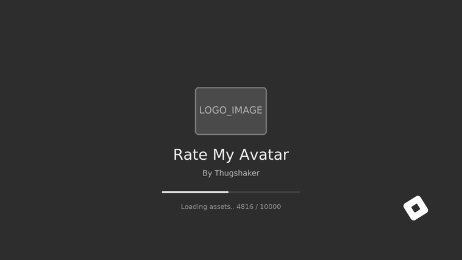
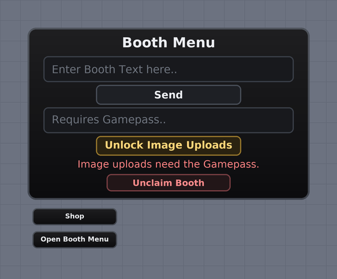
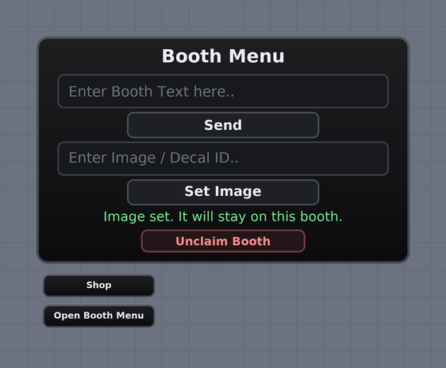
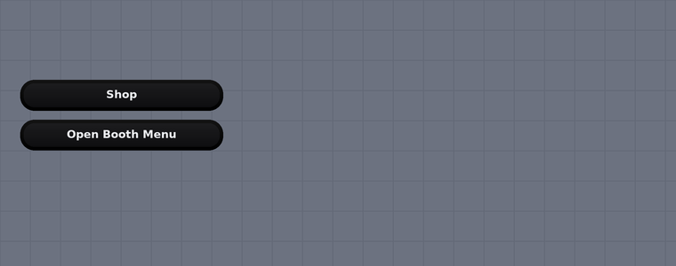
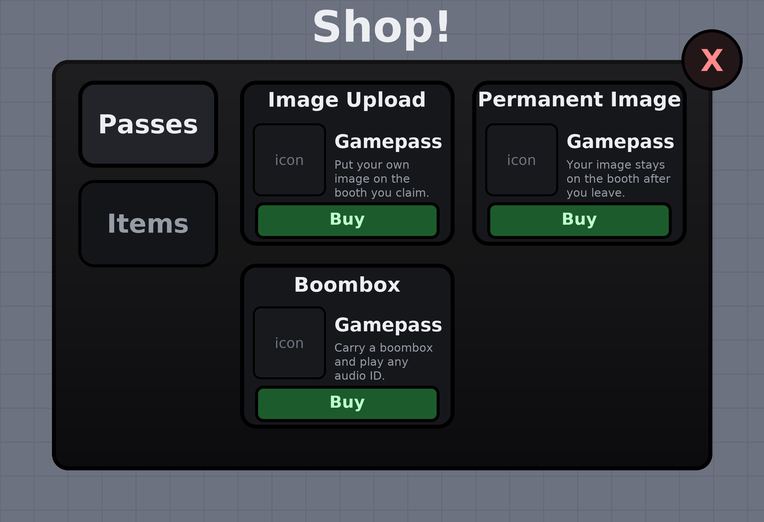
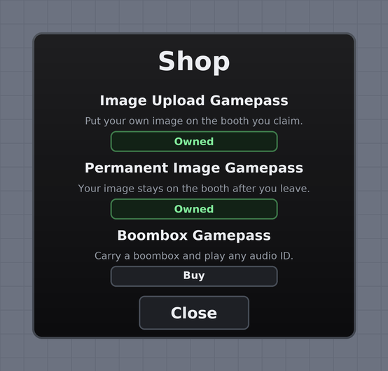
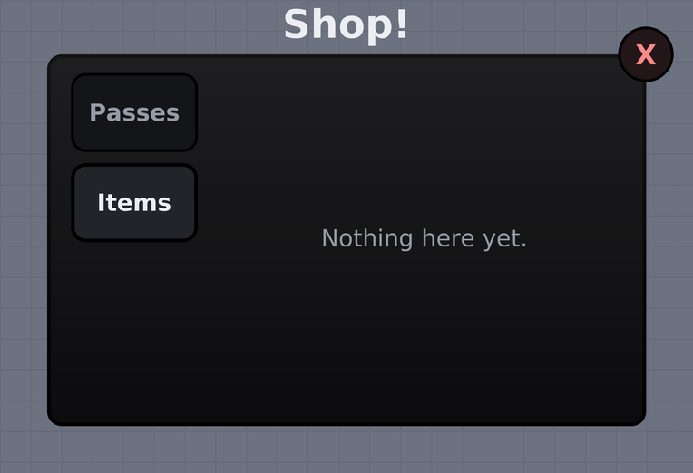
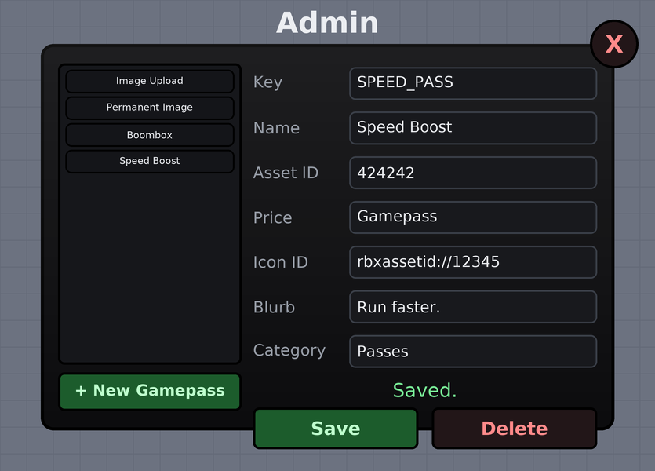
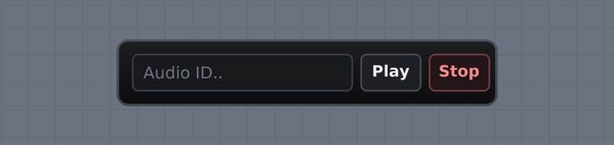

# Rate-my-avatar-korones

Booth system for Pekora: claimable booths, three gamepasses, a shop, a working
boombox and a loading screen. Dark theme throughout.

Original booth system by **ywinfe** and **thugshaker**.

---

## The GUI

> These previews are **rendered from the code**, not screenshotted from a running
> game. `tests/render_previews.py` parses the real `THEME` colours, row heights,
> paddings and pass titles straight out of the scripts and draws them, so they
> cannot drift from what actually ships. Exact in-game fonts and antialiasing
> will differ slightly.

### Loading screen

Styled after the stock Roblox loader: flat dark grey, thin light type, and a
cube spinning in the bottom right. Counts to 10,000 in ~5 seconds then fades
out. Time-driven, so it always takes 5 seconds regardless of framerate.



The cube spins continuously while the bar fills:



#### Swapping in your own logo

The logo sits **above** the title; the title and subtitle stay visible under
it. Until you set an image a dashed `LOGO_IMAGE` placeholder box is drawn, so
the spacing is already correct while you make the art.

Top of `LoadingScreen.client.lua`:

```lua
local LOGO_IMAGE = "rbxassetid://123456789"   -- the logo above the title
local CUBE_IMAGE = "rbxassetid://123456789"   -- replaces the white cube
```

Leave either as `""` to keep the placeholder / default cube. `LOGO_ASPECT`
sets the box shape (width / height) and `LOGO_HEIGHT` its size.

The fonts are `SourceSans` / `SourceSansLight`, the same thin faces the real
Roblox loader uses. `SHOW_BAR = false` removes the progress bar for a pure
stock look.

### Booth menu — locked

Without the upload gamepass the button turns amber, the ID box is read-only and
clicking it opens the shop.



### Booth menu — unlocked



### On-screen buttons

Always visible in the corner.



### Shop

Sidebar tabs on the left, a scrolling grid of item cards on the right. Each
card has an icon, a name, a price label and a Buy button. Everything is drawn
from the server's `PASSES` table, so adding an item is a config change.



Items you already own show **Owned** in green instead of **Buy**:



An empty tab says so rather than looking broken:



#### Adding icons and items

Icons are blank until you set them. In the server script:

```lua
UPLOAD = {
    Id = 356360,
    Category = "Passes",
    Title = "Image Upload",
    Blurb = "Put your own image on the booth you claim.",
    Icon = "rbxassetid://123456789",   -- <- put the id here
    Price = "Gamepass",
},
```

`Icon = ""` draws a plain placeholder box, so the shop looks correct with no
icons set. `Price` is only the label on the card; the real cost is whatever the
catalog item is priced at.

Tabs come from `SHOP_CATEGORIES`. Add a name there, tag items with that
`Category`, and the tab appears.

### Admin panel

Only visible to admins. Left column lists every gamepass, right column edits
the selected one. Creating a pass is filling in the fields and pressing Save —
no code edit, no restart.



### Boombox

Appears at the bottom of the screen only while the tool is equipped.



---

## Install — three scripts, no Command Bar

| # | Where | What |
|---|---|---|
| 1 | `ServerScriptService.Server` | paste `src/ServerScriptService/BoothServer.server.lua` |
| 2 | `StarterGui.MainUI.Client` | paste `src/StarterGui/MainUI/Client.client.lua` |
| 3 | `ReplicatedFirst` → new **LocalScript** | paste `src/ReplicatedFirst/LoadingScreen.client.lua` |

Nothing else. The server builds the rest on its own at run time.

## Self healing

Booths only work inside `Workspace.Booths`, because that is the only place the
server looks. Duplicating in Studio leaves them loose in Workspace, usually
still called `boothgood` — which is exactly what broke `rateava3.rbxl`.

So the server repairs it itself on every boot:

- creates `Workspace.Booths` if it is missing (never `WaitForChild`, which
  would hang forever and break everything)
- sweeps Workspace, adopts anything shaped like a booth, renames it `Booth`
- ignores models that only *look* similar
- builds `ServerStorage.Boombox` if absent

## Admin panel

Set who gets in at the top of the server script:

```lua
local ADMINS = {
    "Thugshaker",
    "ywinfe",
}
local ALLOW_PLACE_OWNER = true
```

Usernames or UserIds both work. The place owner is always let in, so a typo
cannot lock you out.

### Adding a gamepass

Press **+ New Gamepass**, fill in the fields, press **Save**. It appears in
everyone's shop immediately — no rejoin, no code change.

| Field | Meaning |
|---|---|
| Key | Internal name. Auto-uppercased, spaces become `_` |
| Name | Shown on the card |
| Asset ID | The number from the catalog URL |
| Price | Label only; the real cost is the catalog price |
| Icon ID | Accepts a bare id, `rbxassetid://`, or a link with `?id=` |
| Blurb | One line of description |
| Category | Which sidebar tab it lands in |

Custom passes are saved in a DataStore and reload on boot. Purchases route
automatically, because the id lookup is rebuilt on every change.

### What is protected

- **Built ins cannot be deleted**, and their **Key and Asset ID are locked**,
  because `UPLOAD` / `PERMANENT` / `BOOMBOX` are wired into the booth logic.
  Their name, blurb, icon and price are still editable.
- Editing a built in is a **live-only** change; the script wins on next boot.
- Duplicate asset IDs are refused, since the purchase router keys on the id.
- **Every action is re-checked on the server.** Hiding the button is cosmetic;
  a non-admin firing the remote by hand is refused and logged.

## Gamepasses

Sold as Pekora catalog shirts, since real game passes do not work there. All
use `PlayerOwnsAsset` / `PromptPurchase`. Players only ever see the word
"Gamepass", never a shirt name.

| Item | Asset ID | Unlocks |
|---|---|---|
| Image uploads | `356360` | Set the image on the booth you claimed |
| Boombox | `353454` | Boombox tool that plays any audio ID |
| Permanent image | `353447` | Your image stays on the booth after you leave |

Ownership is enforced **on the server**; hiding a button is only cosmetic. It
fails closed, so an API error denies the perk rather than giving it away.

## Permanent images

Buying `353447` makes your image belong to the **booth**, not to you:

- saved per booth by index in a DataStore
- survives unclaim, disconnect and server restart
- the next claimer inherits it, and cannot replace it without `356360`
- `ResetBooth` deliberately does **not** wipe it

Without the pass an image is temporary: shown now, gone on unclaim, and it
never overwrites a paid one.

Unclaimed booths and booths with no saved image show `rbxassetid://821176`.

## Boombox

The tool is generated at run time with just a Handle and a Sound — no scripts
inside it. `Script.Source` cannot be written at run time, so a generated tool
can never carry its own code. The logic lives in the two scripts you already
paste: the server drives the sound, the client draws the panel.

It is currently a **plain black brick**. Drop a boombox model in and it will be
used instead.

## Tests

```bash
python -m venv .venv && .venv/bin/pip install lupa pillow
.venv/bin/python tests/test_features.py     # 45 checks
.venv/bin/python tests/test_admin.py        # 33 checks
.venv/bin/python tests/test_rateava3.py     # 8 checks, against the real place file
.venv/bin/python tests/render_previews.py   # regenerate the images above
```

Covers passes, permanence, inheritance, per-item cache isolation, fail-closed
ownership, DataStore outages, boombox grants, and self-healing the exact
`rateava3.rbxl` layout.

## Known unknowns

- `rbxassetid://821176` is unverified — pekora.zip is unreachable from the
  build environment. If booths look blank, that ID needs swapping.
- Permanent images need **Studio Access to API Services** enabled to save while
  testing in Studio. They work normally in a live server.
